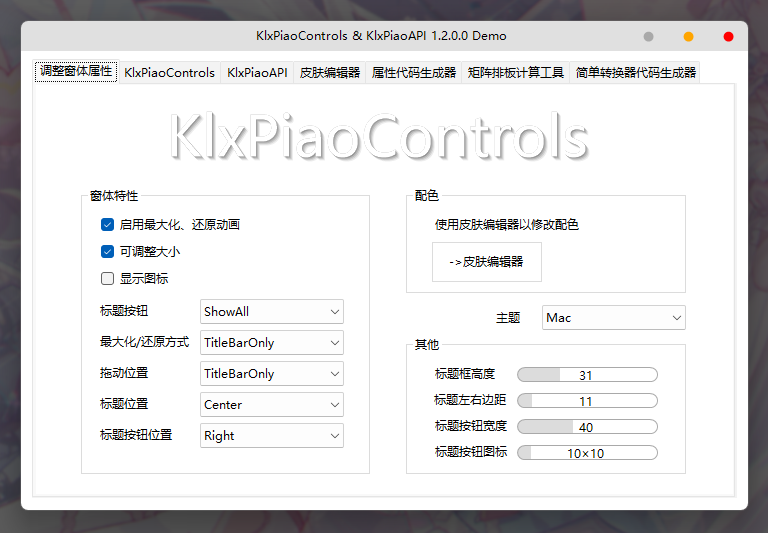
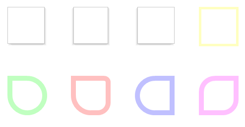
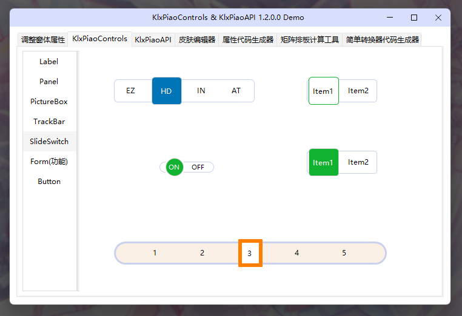

# KlxPiao

提供 WinForms 原版美化和一些小控件

## 简介

> [可以点击这里查看更新日志](/CHANGELOG.md)

> [(未完成的目标)](/TARGET.md)

解决方案提供了两个项目
- KlxPiaoControls:<br>
  提供原版增强的控件，创造这个控件库的初衷是为了能有一个原版增强的 Form<br>

  **使用方法:** <br>
  > 
  > C#
  > ```
  > public partial class MainForm : KlxPiaoControls.KlxPiaoForm
  > ```
  > VB.NET (.Designer 文件中修改继承)
  > ```
  > Inherits KlxPiaoControls.KlxPiaoForm
  > ```
  
  

  其中标题框高度、标题框颜色、标题按钮大小以及样式等等，都是作为属性可以调整的<br>
  标题按钮目前内置了两种风格 ```Windows``` 和 ```Mac``` (标题按钮可以设置为左边仿 MacOS)

  

  控件库也提供了一些原版增强的控件，大部分都添加了圆角边框的属性

  

  

- KlxPiaoAPI:<br>
  创造 **KlxPiaoControl** 时产生的工具类库<br>
  提供了各种类型的扩展方法以及实用方法，例如数据处理、图片处理、布局计算、GDI+快速绘制圆角等

## 预览




